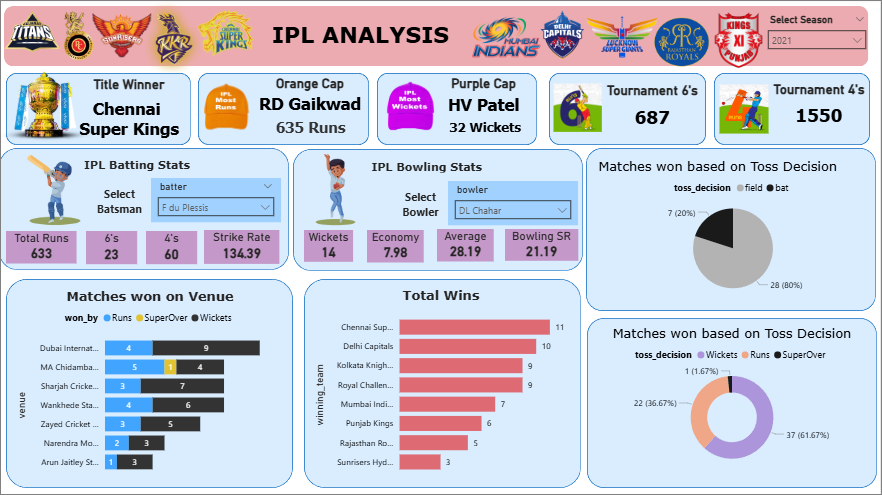

## 🏏 IPL Analysis Dashboard (Power BI)

### 📊 Project Overview

This Power BI project provides an **interactive and insightful analysis of the Indian Premier League (IPL)**.
It focuses on team and player performances, venue-based outcomes, toss impacts, and season-level statistics.
The dashboard helps cricket enthusiasts, analysts, and decision-makers uncover hidden trends and data-driven insights from IPL seasons.

### 📸 Dashboard Preview




---

### 🎯 Objective

The main goal of this project is to **analyze IPL data** using Power BI and derive meaningful insights, such as:

* Team performance comparison
* Top batsmen and bowlers of the season
* Venue-wise match results
* Toss decision impact on match outcomes
* Overall tournament statistics (sixes, fours, etc.)

---

### 📁 Repository Structure

```
📦 IPL-Analysis-Dashboard
│
├── 📊 IPL_Analysis.pbix                # Power BI Project File
├── 📄 README.md                        # Project Documentation
├── 📂 dataset/
│   ├── matches.csv
│   ├── deliveries.csv
│   └── players.csv
└── 📸 IPL_Dasboard.png            # Dashboard Image
```

---

### 🧑‍💻 Author

**Omkar Abhaykumar Patil**
🎓 B.Tech – Computer Science and Business Systems
📊 Data Analytics

---

### 🏁 Conclusion

This IPL Analysis Power BI Dashboard provides **a complete data-driven overview of the tournament**, enabling users to explore, compare, and analyze performances at various levels — team, player, and venue.
It’s a perfect blend of **data storytelling and visual analytics** in sports data.

